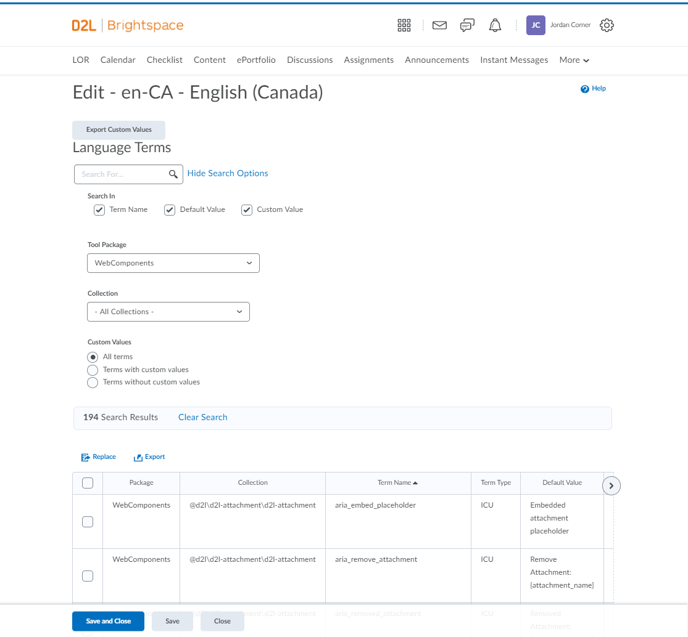

# What is OSLO?
*Offstack Language Overrides*, or **OSLO** provides a way for offstack web components to be able to integrate with language overrides in the LMS. Overrides allow changing the displayed text of almost any term on the platform. For example, if you want to change all occurrences of "Assignments" to "Dropbox" you can do that in the language management tool using language overrides.

*This documentation is intended for developers who would like to simply use language overrides in their web components. If you would like to see detailed documentation regarding architecture and implementation details, please visit this page [TODO - ADD LINK TO MAINTAINER DOCS]()*

# Setting up OSLO for your Webcomponent

  1. [Use Serge for translations](#use-serge-for-translations)
  2. [Follow the OSLO langterm naming convention](#follow-the-oslo-langterm-naming-convention)
  3. [Include your web component within the BSI project](#include-your-web-component-within-the-bsi-project)
  4. [Create a mixin to expose the `localize()` method](#create-a-mixin-to-expose-the-localize-method)
## Use Serge for translations
For more information on how to implement serge within your web component please read [Serge-Localize](https://docs.dev.d2l/index.php/Serge-Localize)
## Follow the OSLO langterm naming convention
The LAIM tool used in the LMS can only accept a set of valid characters. Currently OSLO will accept any character and convert characters not supported by the LAIM tool into their equivalent Unicode representation `\uXXXX"`.


> ⚠ Using invalid LAIM tool characters is not advised because it causes problems when searching for the langterm using the language management tool. Searching will not return a result when using the original character that was parsed.

To mitigate these problems, the following format is recommended:
```
{grandparent}\{parent}\camelCaseTermName
```
`\` can be used to provide hierarchy to term names and allow a grouping of related terms

**Valid characters include:**  
`\` `-` `_` `:` `@` `A-Z` `a-z` `0-9`

**Alternative valid formats:**
```
{grandparent}\{parent}\snake_case_term_name
{grandparent}\{parent}\kebab-case-term-name
{grandparent}:{parent}:camelCaseTermName
```

**Validation:**  
If you would like to test if your term name is valid visit https://regexr.com/ and use the following regex:
```
^[a-zA-Z0-9\\:_-@]*$
```

## Include your web component within the BSI project
This can be done following the [docs](https://github.com/Brightspace/brightspace-integration/blob/master/docs/web-components.md) on the BSI repo.
Specifically your component must do the following step:
> **Lang Terms**
> 
> Optionally, if your component has lang terms managed by Serge.io, add an entry to the .serge-mapping.json file:
> ```
> {
>   ...
>   "my-component": "my-component/my-component.serge.json"
>   ...
> }
> ```

## Create a mixin to expose the `localize()` method

For existing web components the `localize()` method would have been exposed when following the [`localize-mixin`](https://github.com/BrightspaceUI/core/blob/master/mixins/localize-mixin.md) documentation from `@Brightspace-UI/core`. In this case a few things will need to be changed.
- Add `resolveOverridesFunc()` to `getLocalizeResources`
- return `getLocalizeOverrideResources()` inside `if` block
- return `getLocalizeOverrideResources()` inside at end of function
**Important:** This will need to be done for each unique collection name you wish to have. (Each serge object will result in a new collection name)

### Example modifications to create an OSLO mixin
```diff
  import { LocalizeMixin } from '@brightspace-ui/core/mixins/localize-mixin.js';
+ import { getLocalizeOverrideResources } from '@brightspace-ui/core/helpers/getLocalizeResources.js'; // NEWLY ADDED FOR OSLO
  
  export const MyComponentLocalizeMixin = superclass => class extends LocalizeMixin(superclass) {
  
      static async getLocalizeResources(langs) {
      
      
+         function resolveOverridesFunc() {                                                            // NEWLY ADDED FOR OSLO
+             return 'your-npm-package-name\\your-object-serge-name'; // Collection Name               // NEWLY ADDED FOR OSLO     
+         }                                                                                            // NEWLY ADDED FOR OSLO
          
          let translations;
          for await (const lang of langs) {
              switch (lang) {
                  case 'en':
                      translations = await import('./locales/en.js');
                          break;
                  case 'fr':
                      translations = await import('./locales/fr.js');
                      break;
                  }

-             if (translations && translations.default) {
-                 return {
-                     language: lang,
-                     resources: translations.default
-                 };
-             }
+             if (translations && translations.default) {
+                 return await getLocalizeOverrideResources(                                           // NEWLY ADDED FOR  OSLO                              
+                     lang,                                                                            // NEWLY ADDED FOR OSLO
+                     translations.default,                                                            // NEWLY ADDED FOR OSLO
+                     resolveOverridesFunc                                                             // NEWLY ADDED FOR OSLO
+                 );                                                                                   // NEWLY ADDED FOR OSLO
+             }
          }
          translations = await import('../lang/en.js');

-         return {
-             language: 'en',
-             resources: translations.default
-         };  
+         return await getLocalizeOverrideResources(                                                   // NEWLY ADDED FOR OSLO
+             'en',                                                                                    // NEWLY ADDED FOR OSLO
+             translations.default,                                                                    // NEWLY ADDED FOR OSLO
+             resolveOverridesFunc                                                                     // NEWLY ADDED FOR OSLO
+         );                                                                                           // NEWLY ADDED FOR OSLO
      }
  }
```
#### Resolve Override Function
This function must return the collection name for the collection the mixin is being used for.  
Your collection name is determined by npm package name combined with the serge object name.

**Example:**
`npm` package name
```javascript
//package.json
{
    "name": "d2l-activities"
}
```

`serge` object name
```javascript
//repo.serge.json 
{
    "name": "activityEditor",
    "parser_plugin": {
      "plugin": "parse_js"
    },
    "source_match": "en\\.js$",
    "source_dir": "components/d2l-activity-editor/lang",
    "output_file_path": "components/d2l-activity-editor/lang/%LANG%.js",
    "output_lang_rewrite": [
      "ar-sa ar",
      "zh-tw zh-tw"
    ]
  }
```
with the two above objects, the resulting collection name will be:
`d2l-activities\activityEditor`


```javascript
function resolveOverridesFunc() {
    return 'd2l-activities\\activityEditor'; // Collection Name     
} 
```
> **Note:** Make sure to escape the backslash `\`

### Using your mixin
Your component would then use this mixin and have access to the `localize()` method


```javascript
// en.js
export const val = {
  'hello': 'Hello {firstName}!'
};
```

```javascript
class MyComponent extends ComponentLocalizeMixin(LitElement) {
    render() {
        return html`<p>${this.localize('hello', {firstName: 'Mary'})}</p>`;
    }
}
```

# How to work with language overrides

## Background - The Language Management Tool

The language management tool is where Brightspace admins can search langterms and change their default values.

Get to the tool by navigating in Brightspace:  
> Gear(Settings) > Language Management > en-US - English (US)




Selecting "Web Components" from the Tool Package dropdown and hitting search will yield the above table. The table has 6 columns:
- Package
- Collection
- Term Name
- Term Type Default Value
- Custom Value

**Package**  
This is the tool package. When using OSLO with webcomponents your tool package will always be "WebComponents".

**Collection**  
The collection is a grouping of related Term Names. This grouping is up to the discretion of the group creating the terms. A new collection will be automatically created for every object in your [`serge.json`](#use-serge-for-translations) file.

Each collection will have the following naming convention:  
`"{npm-package-name}\{serge-object-name}"`

**Term Name**  
The term name listed in the created language files. This is the object referenced throughout the web component that will be replaced with translations or custom values by the language management tool.

Example terms can be seen in the [activities repository](https://github.com/BrightspaceHypermediaComponents/activities/blob/46f1ff98586f4d6c09c5bf23b717d31c99c5115a/components/d2l-activity-editor/lang/en.js)

**Term Type Default Value**  
This is the default text that will appear throughout the application if left unmodified.

**Custom Value**  
An overridden value to replace the default value. This will be used by Brightspace Admins.


## Creating a new collection
A new collection can be created by making a new project using [Serge](https://docs.dev.d2l/index.php/Serge-Localize). When OSLO builds it will automatically add your collection to the LMS. The new collection name will be a combination of npm package name and serge project name
```
"{npm-package-name\serge-object-name}"
```

**Example**  
The following example will result in a collection name of `"d2l-activities\activityEditor"`

`npm` package name
```javascript
//package.json
{
    "name": "d2l-activities"
}
```

`serge` object name
```javascript
//repo.serge.json 
{
    "name": "activityEditor",
    "parser_plugin": {
      "plugin": "parse_js"
    },
    "source_match": "en\\.js$",
    "source_dir": "components/d2l-activity-editor/lang",
    "output_file_path": "components/d2l-activity-editor/lang/%LANG%.js",
    "output_lang_rewrite": [
      "ar-sa ar",
      "zh-tw zh-tw"
    ]
  }
```

## Hiding a collection
In some cases, you may want to temporarily hide collections from appearing in the language management UI without deleting the terms or collection from the database. In this scenario you can add these collections to [this blocked collections list](https://github.com/Brightspace/lms/blob/master/lp/framework/core/D2L/lang/Provider/BlockedCollections.cs) and they will be hidden from the users in the Language Management UI.


## Deleting a collection
TODO

## Creating a new term
TODO

## Deleting a term
TODO

# API documentation

TODO

[create-a-link-to-api-documentation]()
